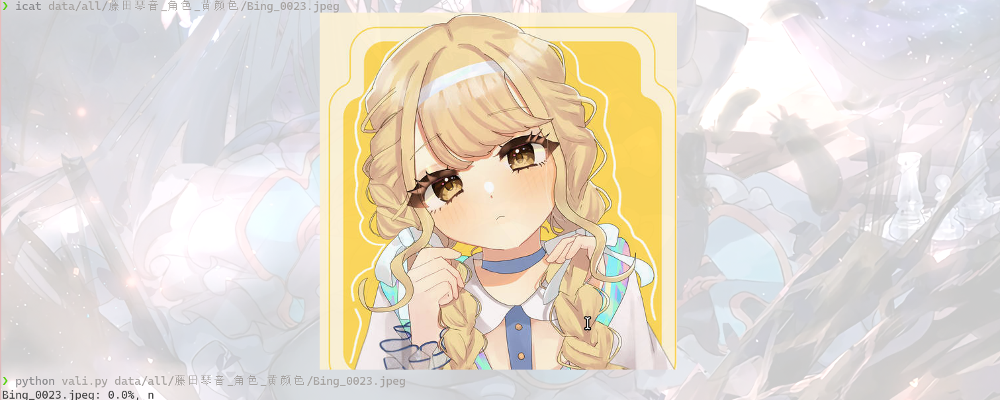
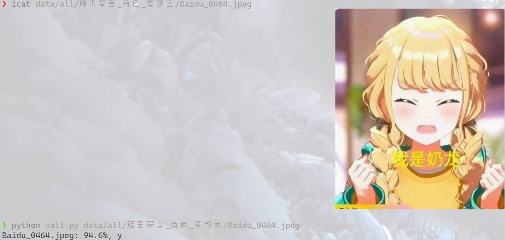
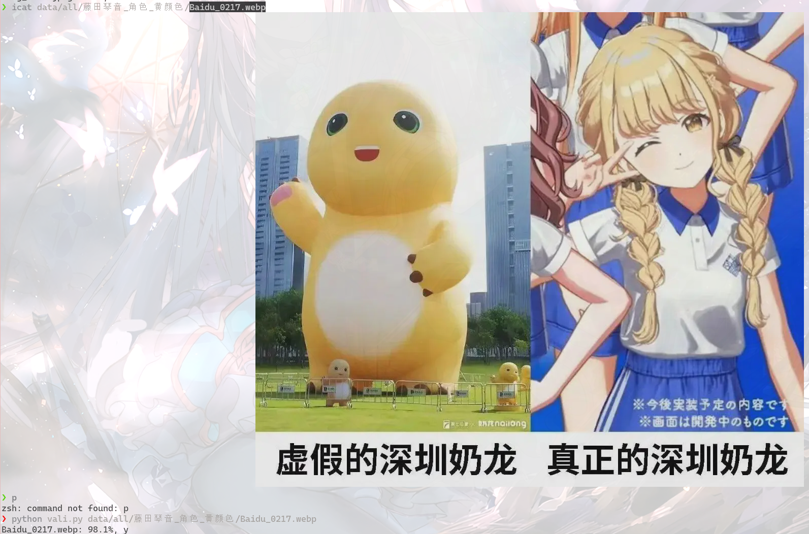
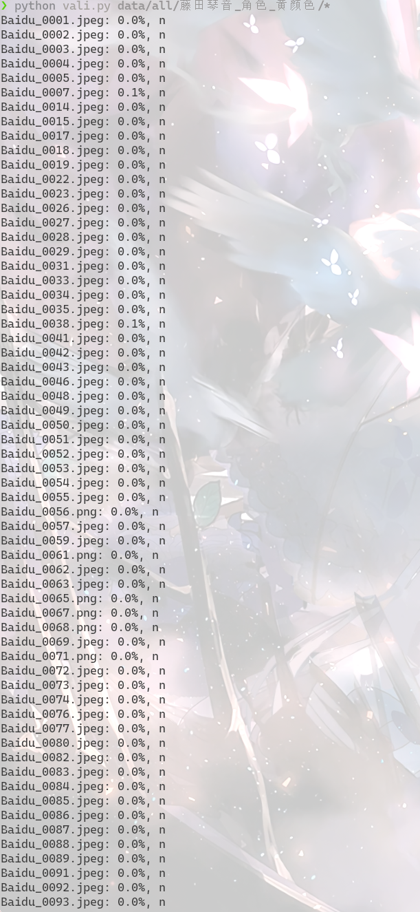

# nailong-classification

基于ResNET的奶龙分类模型， _✨能准确区分藤田琴音和奶龙✨_



## 声明
本插件仅供娱乐和学习交流。

如有侵犯版权行为，请联系开发者。

## 简介

nailong-classification是基于ResNET的奶龙分类模型，在约500张奶龙表情包`、`5000张普通表情包及与奶龙相似物体各数百张的数据集上训练得到，准确率达95%。

数据集结构如下：
```
data
├── all
│   ├── nailong
│   ├── 奶龙_角色_黄颜色
│   ├── 小火龙
│   ├── 小黄人
│   ├── 海绵宝宝
│   ├── 皮卡丘
│   ├── 藤田琴音_角色_黄颜色
│   ├── 黄发_动漫角色
│   ├── 黄色_卡通_动漫
│   ├── 黄色_圆润
│   └── 黄颜色_表情包
├── temp.py
├── test
│   ├── nailong
│   └── other
└── train
    ├── nailong
    └── other
```

完整数据集可在huggingface下载：
https://huggingface.co/datasets/XiC1/nailong-dataset

## 使用

从 https://huggingface.co/XiC1/nailong_model 下载模型

修改``vali.py``中``model_path``
```
python vali.py nailong.png xiaohuolong.jpg
```
## 数据来源

普通表情包：[Emo Visual Data](https://github.com/LLM-Red-Team/emo-visual-data)

其他图片：百度图片、必应图片

## 藤田琴音

发现数据集中除了这两张以外均可正确识别：






